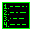
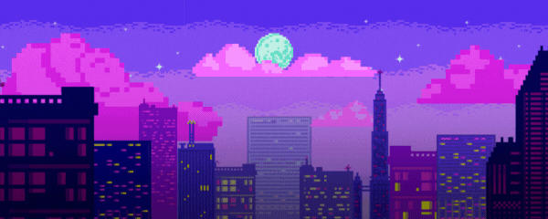

<h1 align="center"> Hi! I'm MoCHivEE </h1>

   MAKING CODE & DESIGNING DREAMS 

  

🔭 <b>Currently working on:</b> Creative design projects combining motion, branding, and web interactivity. 

👯 <b>Looking to collaborate on:</b> Branding, digital campaigns, motion graphics, and creative web experiences. 

🤝 <b>Looking for help with:</b> Expanding my freelance network and exploring new creative opportunities. 

🌱 <b>Currently learning:</b> Advanced web animations and modern UI/UX trends.  

💬 <b>Ask me about:</b> Design workflows, motion graphics, or bringing static ideas to life.  

---

  
  
  

---

  

---

  &nbsp;&nbsp;
  &nbsp;&nbsp;
  &nbsp;&nbsp;
  &nbsp;&nbsp;
  &nbsp;&nbsp;
  &nbsp;&nbsp;
  &nbsp;&nbsp;
  

