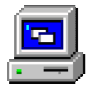
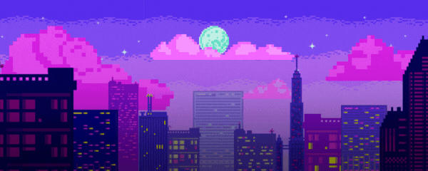

<h1 align="center">Hi there! I'm MoCHivEE </h1>

   Making Code & Designing Dreams 

  

🔭 Currently working on: Creative design projects combining motion, branding, and web interactivity  
👯 Looking to collaborate on: Branding, digital campaigns, motion graphics, and creative web experiences  
🤝 Looking for help with: Expanding my freelance network and exploring new creative opportunities  
🌱 Currently learning: Advanced web animations and modern UI/UX trends  
💬 Ask me about: Design workflows, motion graphics, or bringing static ideas to life  

---

  <a href="#"> <strong>PHOTOSHOP</strong></a>&nbsp;&nbsp;
  <a href="#"> <strong>ILLUSTRATOR</strong></a>&nbsp;&nbsp;
  <a href="#"> <strong>AFTER EFFECTS</strong></a>&nbsp;&nbsp;
  <a href="#"> <strong>PREMIERE PRO</strong></a>&nbsp;&nbsp;
  <a href="#"> <strong>RESPONSIVE WEB DESIGN</strong></a>&nbsp;&nbsp;
  <a href="#"> <strong>CANVA</strong></a>&nbsp;&nbsp;
  <a href="#"> <strong>KRITA</strong></a>

---

  
  
  
  
  
  
  
  

---

  

